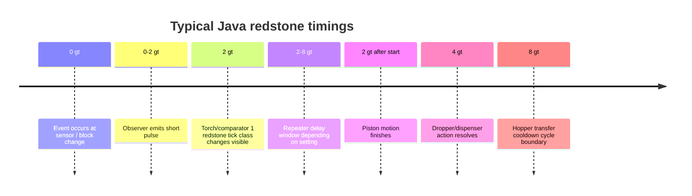
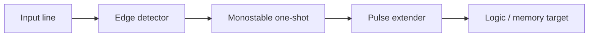
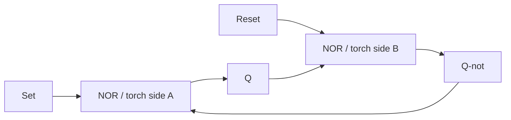
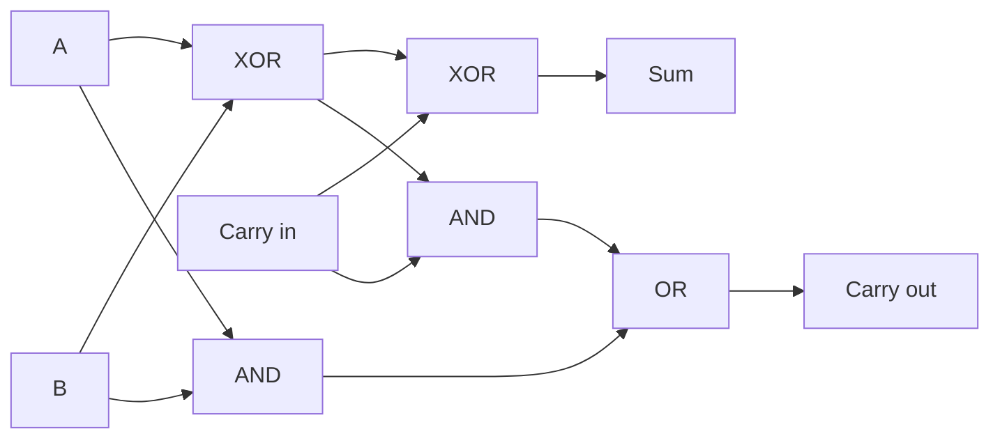

# Minecraft Redstone as a Computational Model

> **What this file is and how to use it.** This is Matthew's reference for explaining AI (and computing) concepts in redstone terms. When something abstract comes up — memory, signals, thresholds, routing, timing — pull the matching idea from here so the analogy is grounded in how redstone *actually* works, not a made-up comparison. It's a *lens*, never the only explanation. Always explain the real concept first; offer the redstone version second. (Citation markers and export artifacts from the original research have been cleaned up for readability.)

## Executive Summary

Assuming the latest **stable** Java Edition on 2026-06-12, the correct baseline is **Minecraft Java Edition 26.1.2**, released April 9, 2026. The next drop, **26.2**, was still in release-candidate status on June 11, 2026 and scheduled for full release on June 16, 2026, so it should not be treated as the stable target for rigorous design work. Mojang changed Java's version numbering in late 2025, which is why current release names are `26.x` rather than `1.21.x`.

For computational thinking, Minecraft redstone is best modeled as a **discrete-time, event-driven machine** with two overlapping signal layers: a **binary activation layer** for mechanisms being on/off, and a **4-bit analog layer** carried by redstone strength values from **0 to 15**. Redstone dust attenuates by **1 per block** and therefore carries power for at most **15 dust segments** before needing regeneration; repeaters restore full strength and enforce direction; comparators preserve or compute lower strengths and therefore behave like threshold, subtraction, and state-read devices rather than simple wires.

The most useful "how a brain works" mapping is this: **buttons, plates, levers, and observers** act like sensory spikes and triggers; **dust, repeaters, and comparators** act like axons, buffered synapses, thresholds, and inhibitory arithmetic; **torches** behave like default-on inhibitory neurons; **RS latches, T flip-flops, and D-style registers** implement working memory and mode state; **counters and adders** implement accumulation, evidence integration, and timekeeping; **multiplexers, demultiplexers, and buses** implement attention, routing, and selection; and **chunk loading / tick rules** act like the physical limits of the substrate.

The central engineering lesson is that **compact redstone is not automatically good redstone**. Piston tricks, quasi-connectivity, and same-tick races can produce extremely dense circuits, but they are also the first things to become brittle under version changes, chunk interactions, or server-side optimizations. Repeater/comparator-heavy designs are usually larger and slower, but they are easier to explain, easier to verify, and better for a system meant to be understood by someone else. Since Java 1.21.2, Mojang also changed redstone wire update behavior for more deterministic and lower-overhead propagation, which improved performance but also altered some edge-case machine behavior.

## Version Baseline and Modeling Lens

The current stable baseline is **26.1.2**, while **26.2** was still a candidate build as of 2026-06-12. That matters because redstone timing, chunk behavior, and update order are version-sensitive, and because public community designs often use older names like "1.21 redstone" even when the stable implementation has moved on.

Conceptually, redstone is not a literal voltage simulation. It is a rule system built from **power components**, **transmission components**, **mechanism components**, and **supporting blocks**. Mechanisms can be activated by adjacent power sources, powered opaque blocks, repeaters/comparators facing them, or dust pointing into them. Opaque blocks can be **strongly powered** or **weakly powered**; transparent blocks cannot be powered the same way and are often used as insulators in compact logic. This is one core reason beginner-looking builds are often easier to debug than hyper-compact ones: the build is really a graph of update relations, not just a visible line of "wire."

At the implementation layer, the game code reinforces this structured view. The deobfuscated Yarn API shows that `AbstractBlock#getComparatorOutput` standardizes comparator-readable outputs on the **0–15** range; `ComparatorBlock` exposes a `MODE` property and overrides `getPower`; and `ObserverBlock` exposes a `POWERED` state and scheduled-tick/update-neighbor logic. That is exactly the mental model technical builders use: comparator outputs are a standardized analog read path, comparators have explicit logic modes, and observers are pulse generators driven by state transitions rather than steady power.

For AI/brain modeling, this makes redstone unusually good for explaining **finite-state**, **signal-routing**, and **register-transfer** style cognition, but only moderately good for modeling continuous neural dynamics. The analog range is only **4 bits** wide, and most mechanisms still collapse to discrete changes. The sweet spot is to describe redstone-like cognition as a system of **gated state**, **edge-triggered events**, **mode latches**, **thresholded comparisons**, and **rippled accumulations** rather than free-form analog neural fields.

## Electrical Semantics and Tick Timing

Redstone strength is an integer from **0 to 15**. Dust receives power from adjacent power components or strongly powered blocks, and attenuates by **1 strength per dust block**, giving ordinary dust a hard transmission limit of **15 blocks**. Repeaters restore the line to full **15**; comparators may emit any lower level. This is the most important computational fact in the system: redstone combines two paradigms — binary activation for mechanisms and **small-range analog arithmetic** for line levels, comparisons, fullness reads, and sensor outputs.

Opaque block powering is equally fundamental. Active power components, active repeaters, and active comparators can strongly power opaque blocks; powered dust on top of or pointing into a block weakly powers it. A weakly powered block cannot power adjacent dust onward, but it can still activate nearby mechanisms and feed repeaters or comparators. Transparent blocks do not participate the same way and act as separators. This is why builders think in terms of "signal carriers" and "signal blockers" rather than just wire layout.

Timing is discrete. A **game tick** is the base simulation step, and the technical community uses **redstone tick** to mean **2 game ticks**. Repeaters delay signals by **1 to 4 redstone ticks**; comparators take **1 redstone tick** to transmit rear or side-input changes; redstone torches take **1 redstone tick** to change state and usually ignore 1-tick fluctuations; pistons begin extending/retracting immediately when state changes but finish motion after **2 game ticks**; hoppers transfer with a **4 redstone tick** cooldown; droppers and dispensers respond after **2 redstone ticks** and only on the **rising edge** of their input.

Observers are the canonical edge detectors. When the block or fluid in front of the observer changes, it emits a **quick pulse** from its rear. That makes the observer the closest thing redstone has to a generalized "spike detector": it collapses a change-of-state event into a short output pulse.

The modern update-order story also matters. In Java 1.21.2, Mojang changed redstone wire so it now only sends block updates to blocks that may receive power, sets the new strengths of all connected wires before issuing block updates, and uses a more context-driven (though not perfectly universal) update order around wire. The goal was to cut performance cost and reduce location/orientation dependence, while accepting some cases where order is still chosen by context or unresolved ties. For computational redstone, **long dust networks are cleaner and cheaper than before**, but old machines that depended on hidden update quirks may have changed behavior.

## Component Reference and Design Vocabulary

Vanilla does **not** publish an official per-block CPU cost metric, so the "tick cost" labels below are **qualitative engineering estimates** based on update frequency, official wire optimization notes, hopper behavior, and server-side documentation about redstone overhead. Read the table as a design triage tool, not a benchmark.

### Sources and transmission components

| Component | Concise explanation | Construction role | Latency / persistence | Range / signal | Update behavior | Tick cost | AI / brain use-case | Notes & limits |
|---|---|---|---|---|---|---|---|---|
| Block of redstone | Constant always-on source | Static bias, mode enable, piston-carried power | Continuous while present | Adjacent activation only; does not power adjacent opaque blocks | Immediate source state | Low | Tonic drive / always-on bias | Great for compact piston logic; dangerous in always-active dust webs. |
| Lever | Manual toggle source | Human-set mode switch | Persistent until toggled | Adjacent power | Event on toggle, then steady | Low | Long-term state / mode bit | Best when a mode should survive without clocks or memory cells. |
| Button | Manual pulse source | Trigger, step, clock seed, single-action input | Short pulse | Adjacent power | Both rising and falling edges matter downstream | Low | Spike-like sensory cue | Feed into pulse shapers or T flip-flops if downstream expects edge logic. |
| Pressure plate | Entity sensor | Presence detector, occupancy gate, trigger | Sustained while triggered | Adjacent power through supporting block rules | Entity-driven updates | Low | Sensorium / contact receptor | Good for "attention when occupied." |
| Opaque block | Wiring substrate and power carrier | Strong/weak power relay, torch mount, diode staging | No deliberate delay | Adjacent block-power propagation | Depends on what powers it | Low | Shared state substrate | Strong vs weak power is the key to clean buses and avoiding feedback. |
| Redstone dust | Analog/binary line | Main bus, merge, fanout, analog strength carrier | No configurable delay; attenuates across line | Max **15 dust** before strength hits 0 | Network-style strength recomputation + neighbor updates | Medium–high in large meshes | Axon / shared signal bus | Cheaper since 1.21.2, but large dust carpets are still a top overhead source. |
| Repeater | Directional full-strength buffer | Booster, delay, diode, line isolator, lockable stage | **1–4 redstone ticks** | Restores output to **15** | One-direction propagation; can be side-locked | Low–medium | Buffered synapse / directed edge | Break feedback, regenerate buses, trade space for determinism. Locking = gated memory. |
| Comparator | Analog compare/subtract/read device | Thresholding, subtraction, fullness read, analog gate | **1 redstone tick** | Outputs **0–15**, often less than input | Rear input with side modification; reads containers + special blocks | Medium | Threshold unit / inhibitory arithmetic / state reader | Best block for modeling weights, thresholds, and "confidence" levels. |
| Redstone torch | Default-on inverter & vertical source | NOT gate, state memory, torch towers, RS latches | **1 redstone tick** | Powers adjacent dust/diodes/mechanisms to **15** | Inverts attachment-block power | Low | Inhibitory neuron | Burns out if forced to change >**8 times in 60 game ticks**; never build high-frequency clocks on torches unintentionally. |

### Sensors, actuators, and item-logic components

| Component | Concise explanation | Construction role | Latency / persistence | Range / signal | Update behavior | Tick cost | AI / brain use-case | Notes & limits |
|---|---|---|---|---|---|---|---|---|
| Observer | Detects change in front block/fluid, emits quick pulse | Edge detector, event sensor, pulse cleaner, scheduler trigger | Short pulse after observed change | Rear pulse output | Event-driven; powered state / scheduled updates | Medium | Spike detector / temporal derivative | Cleanest way to convert change into a pulse — better than torch hacks for clarity. |
| Piston / sticky piston | Moves blocks and entities; sticky also pulls | Physical data routing, state materialization, extenders, TFFs, muxes | Motion completes after **2 game ticks** | Can push up to **12 blocks** | May include Java-only quasi-connectivity; motion creates updates | Medium–high | Structural gating / embodiment / route switching | Powerful but brittle under short pulses and QC edge cases; pulses <**1.5 ticks** can drop blocks. |
| Hopper | Pulls/pushes items between inventories and world | Queue, timer, analog memory, item counter, sorter core | Transfer cadence **4 redstone ticks** | Comparator-readable fullness | Pushes before pulls; powered hopper is disabled | High | Token queue / reservoir / accumulator | One of the most powerful and costliest blocks — power idle hoppers, use only where stateful item logic matters. |
| Dropper | Ejects/transfers one item on rising edge | Item pulse generator, token mover, vertical transport, counters | **2 redstone ticks** to response | One item per activation | Ignores extra inputs during delay; can use QC | Medium | Discrete token emitter | Cleaner than dispensers for pure item motion. |
| Dispenser | Uses/throws an item on rising edge | World interaction, fluids, projectiles, farms | **2 redstone ticks** to action | One action per activation | Rising-edge only; can use QC | Medium | Actuator / effecter | Clocked faster than **5 Hz** can fire once then lock "on" — use deliberate pulsing. |
| Note block | Plays note and emits adjacent block updates | Audible debug, sequencer, instrumentation | Immediate on activation if valid | Sound + local block updates | Needs air above to sound | Low–medium | Probe / telemetry / debugging channel | Great for making invisible timing visible; also participates in quirky event circuits. |

A few heuristics matter disproportionately. For **clarity**, prefer **comparator + repeater + observer** logic. For **minimum size**, introduce **pistons and redstone blocks**. For **state over time**, item logic with **hoppers/droppers/comparators** is most expressive. For **human debugging**, use **note blocks** and visible lamps at register boundaries. These are different design languages layered on the same substrate.

## Logic, Pulse, and Memory Primitives

Latches and flip-flops are **1-bit memory cells** that enable **sequential logic** — the exact technical bridge from "contraptions" to "brains." As soon as your machine's output depends on **previous inputs**, you are no longer just wiring conditions together; you are building memory, control flow, and state machines.

### Combinational logic gates

| Gate | Concise explanation | Construction pattern | Brain-style use | Limitations | Optimization hint |
|---|---|---|---|---|---|
| OR | Output if **any** input is on | Safe line merge with diode isolation if needed | Salience merge, "any cue wakes this module" | Plain dust merges can backfeed | Use repeaters when merging independent subsystems. |
| NOR | Output only if **all** inputs are off | Torch-only inversion hub; can be as small as **2×1×1** with 3 inputs | Default-active inhibition, "rest unless suppressed" | Torch burnout if abused | Smallest, cleanest multi-input negative logic. |
| AND | Output only if **all** inputs are on | Repeater/torch or piston-tristate; basic design **2×2×3**, 2-tick delay | Coincidence detector, conjunctive feature binding | Ripple delay if stacked | Use repeater-lock / diode isolation on noisy buses. |
| NAND | Inverted AND; universal gate | AND + torch inversion, or direct NAND | "Everything permitted unless all blockers present" | Extra inversion adds latency / torch risk | Good fallback for a universal primitive set. |
| XOR | Output if inputs differ | Comparator/piston/repeater exclusivity design | Novelty detector, parity, "change happened here" | More complex; compressed builds mis-time easily | Use for toggles/equality, not as a default gate. |
| XNOR | Output if inputs are equal | XOR + inversion | Match detector, equality check | XOR complexity + inversion | Useful for "did expectation match reality?" |

### Pulse shaping, monostables, bistables, and clocks

Pulse logic is the temporal grammar of redstone. The right question is often not "is this signal on?" but "**when did it change, and for how long?**"

The simplest **one-shot / monostable** is the **circuit breaker** pulse limiter: a **1×3×3** variant with **1 tick** delay and a **1-tick output pulse** — the friendliest way to convert a sustained input into a clean event. For longer one-shots, repeater-line and comparator-fader pulse extenders are standard. The repeater-line extender is **2×N×2**, output = input pulse plus extension per repeater. Comparator fader loops provide longer analog-ish decays — excellent whenever "memory fades unless refreshed" is the metaphor.

For persistent oscillation, hopper clocks are the canonical long-period reliable oscillator. The compact hopper-loop clock is **1×3×2**, with **4 ticks on, 4 ticks off** (8-tick period) for one item. Hopper clocks are stable and easy to reason about; torch clocks are more compact but the most likely to cause lag or burnout.

### Memory cells and working-state structures

| Memory primitive | Concise explanation | Construction pattern | Brain interpretation | Limitations | Optimization tip |
|---|---|---|---|---|---|
| RS NOR latch | Stores 1 bit by cross-coupled inversion; separate set/reset | Two cross-coupled torches or NOR structures | Working memory, intention state, goal flag | Simultaneous/badly-isolated inputs cause ambiguity | Use isolated I/O variants in a larger bus. |
| RS latch (general) | Same storage family, cleaner interfaces | Torch, repeater-lock, or piston-assisted | Persistent context that survives loss of stimuli | Variants trade space for isolation | Use repeater isolation if humans/buses touch it often. |
| T flip-flop | Toggles state on each trigger pulse | Sticky-piston/redstone-block toggle or repeater-lock | Alternating attention, phase bit, binary counting stage | Piston TFFs are pulse-width sensitive | Use repeater-lock TFFs for explainability; piston TFFs only when space matters. |
| D flip-flop / register | Captures data when "clocked," then holds | Gated latches or master–slave latch pairs | Register, snapshot, "belief at moment of sampling" | Larger/slower than simple latches | Use only when you truly need sampling on command. |

## Arithmetic, Routing, and Brain-Style Architectures

Redstone computers are mostly built from **logic + memory + routing**, not a special "math block." A **full adder** is a composition of **two XOR gates, two AND gates, and one OR gate**. Once you see that, addition stops being mysterious: it's just structured propagation of carries through repeated 1-bit slices.

Counters and accumulators follow: latches let state persist between pulses, enabling **counters** and long clocks. Binary counters are usually **ripple structures** — each stage is a toggle/pulse-divider whose output triggers the next on overflow. Perfect models for "evidence accumulation," "steps completed," or "time since last event," but larger counters accumulate propagation delay.

Subtraction is often not a separate family; it's an **adder problem with inversion and carry/borrow handling** (two's-complement style). Routing matters as much as arithmetic: a **multiplexer** selects one of several inputs by a control input; a **demultiplexer** routes one input to one of many outputs via binary-decoded AND logic. These are the redstone analogues of **attention**, **switching**, **binding**, and **fanout control**: the machine isn't just computing, it's deciding **which stream is currently relevant**.

| Topic | Concise explanation | Common pattern | Brain use-case | Limitations | Optimization tip |
|---|---|---|---|---|---|
| Half / full adder | Sum plus carry | XOR + AND + OR slices | Evidence integration, score accumulation | Ripple carry → growing latency | Keep words narrow unless precise arithmetic is needed. |
| Subtractor | Difference plus borrow, or adder-style inversion | ALU variant | Negative error, prediction-vs-input gap | Borrow/carry chains slower/wider | If you only need compare/threshold, use comparators. |
| Binary counter | Increments state across bits | TFF/latch chain, ripple counter | Step counter, timer, reward trace | Ripple delay + reset complexity grow with width | Use event pulses rather than always-on clocks. |
| Multiplexer | Chooses one of multiple inputs | AND-gate mux **3×5×3**, 2-tick delay | Attention switch, route select | Control races can expose wrong path | Put repeaters on data inputs when muxing shared buses. |
| Demultiplexer | Routes one input to one of many outputs | Binary-decoded AND / piston-mask | Action selection, write-enable, decoder tree | Messy if hand-wired | Prefer tree / piston-mask for many outputs. |
| Bus | Shared multi-line route | Dust lanes, repeater-isolated lines, comparators for analog rails | Register file, state distribution, message passing | Crosstalk, backfeed, attenuation | Use repeaters as diodes/regenerators at bus boundaries. |

## Reliability, Chunk Locality, and Optimization

Redstone only exists as computation if the world is actually simulating it. Simulation distance defines a **square region** of chunks around the player where entities are ticked; one chunk farther out is a one-chunk-thick frame where **redstone may still run** and fluids may still flow; beyond that, nothing changes. "Perfectly working" logic can still fail because it crossed the active simulation boundary or because one subsystem depends on entities and another doesn't.

Spawn chunks matter for the same reason. Mojang's 2024 change made the radius configurable with `spawnChunkRadius` and reduced the default by **98%** (new default **2**). Don't assume a big spawn-area machine keeps running forever without a deliberate loading policy. For a persistent background process, the loading model must be part of the architecture, not an afterthought.

The biggest performance offenders in large systems are **always-active dust networks**, **high-frequency clocks**, and especially **hoppers** (4-redstone-tick cooldown, frequent item checks). Modern wire became cheaper in 1.21.2 by reducing unnecessary neighbor updates — but "cheaper" is not "free," especially in large meshes and feedback-heavy designs.

Pistons, dispensers, and droppers add their own failure modes. Java-only **quasi-connectivity** means they can activate from power conditions above them when a block update arrives, even without obvious direct power — a major source of compactness and of debugging pain. Sticky pistons driven by pulses shorter than **1.5 ticks** can leave blocks behind. Dispensers misbehave if clocked faster than **5 pulses/second**.

The most robust optimization rule: **make inactive things truly inactive**. Power idle hoppers, favor event-driven logic over free-running clocks, use repeaters to cut giant dust meshes into directional segments, prefer comparators over hoppers when you only need a threshold, and use piston/QC tricks only where saved space beats the explanation burden. On non-vanilla servers, Paper exposes alternative redstone implementations (**Eigencraft**, **Alternate Current**) to reduce lag — but warns it can't perfectly match vanilla. Server optimization and behavior fidelity are sometimes in tension.

### Compactness versus reliability

| Design family | Typical size | Typical timing | Reliability | Why you use it | Main hazard |
|---|---|---|---|---|---|
| Basic NOR gate | Very small (**2×1×1**) | Torch-speed | High if not overclocked | Tiny negative logic + RS cores | Torch burnout if abused |
| Basic AND gate | Small (**2×2×3**) | 2 ticks | High | Clean condition binding | Delay stacks in larger networks |
| Circuit breaker pulse limiter | Very small (**1×3×3**) | 1-tick delay, 1-tick pulse | High | Level → event | Too-short pulse for some actuators |
| Repeater-line pulse extender | **2×N×2** | Adds extension per repeater | High | Timers, debouncing, refractory windows | Becomes bulky fast |
| Hopper-loop clock | **1×3×2** core | 8-tick period (one item) | Very high | Stable clocking, long timers | Hopper cost in parallel copies |
| RS-NOR latch | Small–medium | Fast, asynchronous | High if inputs isolated | Fundamental 1-bit memory | Bad isolation → interference |
| Repeater-lock bistable | Medium | Repeater-delay class | Very high | Clean mode/state hold | Larger than torch memory |
| Sticky-piston TFF | Small–medium | Fast; pulse-width sensitive | Medium | Compact toggles/counters | Short-pulse quirks, QC issues |
| Comparator threshold / fader loop | Medium | Comparator-speed + loop time | High | Analog decay, thresholds | Harder to visualize than repeaters |
| AND-gate mux | Medium (**3×5×3**) | 2 ticks | High | Clean route selection | Control/data races if poorly isolated |

If the "brain" is meant to be **teachable**, the best default style is: **observer for sensing, comparators for thresholds, repeaters for isolation, RS/T structures for working memory, ripple counters for elapsed time, muxes for attention, and hoppers only where token/stateful item flow is essential**. Not the smallest — the most interpretable.

## Source Map (for going deeper)

The highest-yield reference families are the Minecraft Wiki's **Redstone circuits/Logic**, **/Pulse**, **/Clock**, **/Memory**, and **/Miscellaneous** pages, plus **Tutorials/Logic gates**, **Tutorials/Advanced redstone circuits**, and **Tutorials/Redstone computers** — the best places for concrete topologies (gates, muxes, pulse shapers, counters, ALU-like structures).

For community explanation and *style of reasoning*: **mattbatwings** (formal logical redstone + redstone-computer pedagogy), **Cubicmetre** (engineering intuition), **Mumbo Jumbo** (broad practical literacy), and **ilmango** (technical mechanics + timing). Good companions when you want not just facts but the way technical Minecrafters reason about complex systems.

Note: many community design pages are catalogs of **multiple competing designs**. A T flip-flop can be piston-based, repeater-lock-based, or rail-based; a D-style cell can be latch-first or master–slave; a mux can be gate-based or piston-mask-based; a bus can be binary-only or analog-assisted. Those are architectural taste decisions, not contradictions in the mechanics.
